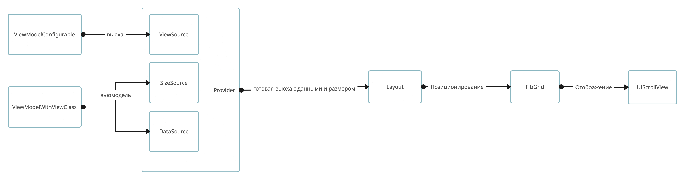

# FIBKit
> Fast interface builder

**Spicy `UIKit ` taste like `SwiftUI`**


### Фичи

* Изменение данных "на лету"
* Никаких больше адаптеров и делегатов для таблиц!
* Автоматическое обновление только тех вьюх, которым требуется это
* Из коробки поддерживает секции, что позволяет быстро строить комплесные интерфейсы
* Анимации просто работают
* Поддержка свайпов
* Встроенное меню и подсказки как в tooltipKit
* Drag&Drop

## Установка

```swift
# SwiftPM
dependencies: [
    .package(url: "https://github.com/pockerhead/FibKit.git")
]
```

## С чего начать
	

### ViewModel
Представим практическую задачу, с которой сталкивается каждый разработчик, у нас есть некий JSON:

```swift
#pokemon
{
	"id": "25",
    "name": "Pikachu",
    "image": "https://pokemon.com/25/image.png",
    "types": ["electric"]
}
```
У нас она будет выглядеть как-то так:

```swift
struct Pokemon: Codable, ViewModelWithViewClass {
    var id: String = ""
    var name: String = ""
    var image: Data?
    var types: [String] = []
    
	func viewClass() -> ViewModelConfigurable.Type { PokemonView.self }
}
```
### View
ViewModelWithViewClass требует от нас реализовать функцию viewClass, которая, в данном случае, возвращает некий класс PokemonView, предлагаю посмотреть на его реализацию:

```
final class PokemonView: UIView, ViewModelConfigurable {

	let pokemonImageView: UIImageView = UIImageView()
	let nameLabel: UILabel = UILabel()
	
	override init(frame: CGRect) {
		super.init(frame: frame)
		configureUI()
	}
	
	required init?(coder: NSCoder) {
		super.init(coder: coder)
		configureUI()
	}
	
	func configureUI() {
		addSubview(pokemonImageView)
		addSubview(nameLabel)
		pokemonImageView.backgroundColor = .systemFill
		pokemonImageView.layer.cornerRadius = 4
	}
	
	override func layoutSubviews() {
		super.layoutSubviews()
		pokemonImageView.frame = .init(origin: CGPoint(x: 16, y: 0 ), size: CGSize(width: 64, height: 64))
		let nameX: CGFloat = pokemonImageView.frame.maxX + 16
		nameLabel.frame = .init(origin: CGPoint(x: nameX, y: 0 ), size: CGSize(width: bounds.width - nameX - 16, height: 20))
	}
	
	/// returns size dependent on data and target size of superview
	func sizeWith(_ targetSize: CGSize, data: ViewModelWithViewClass?, horizontal: UILayoutPriority, vertical: UILayoutPriority) -> CGSize? {
		return .init(width: targetSize.width, height: 64)
	}
	/// Configures view
	func configure(with data: FibKit.ViewModelWithViewClass?) {
		guard let data = data as? PokemonViewModel else { return }
		if let imageData = data.image {
			pokemonImageView.image = UIImage(data: imageData)
		}
		nameLabel.text = data.name
	}
}
```
Это по сути своей обычная вьюха, но необходимо обратить внимание на 2 метода: `sizeWith` и `configure`. Первый отвечает за размер нашей вьюхи, в данном примере она будет на всю ширину и высотой 64. Второй отвечает за конфигурацию вьюхи, туда и приходит PokemonViewModel, все что надо это скастить тип и заполнить нашу вью данными.
### ViewController
```
final class PokedexViewController: FibViewController {
	
	@Reloadable
	var pokemons: [PokemonViewModel] = []
	
	override var body: SectionProtocol? {
		ViewModelSection {
			pokemons
		}.layout(FlowLayout(spacing: 16))
	}

	override func viewDidLoad() {
		super.viewDidLoad()
		title = "Pokedex"
		Task { [weak self] in
			self?.pokemons = try await PokemonService().loadPokemons()
		}
	}
}
```
Здесь все просто, в `body` мы указываем наши данные в специальной конструкции класса `ViewModelSection`. 
> ViewModelSection - провайдер, который презентует наши вьюмодели в вьюклассы...

**Подробнее это будет описано в доке**

Изначально массив pokemons пустой, но когда придут данные экран сам обновится. За это отвечает аннотация **@Reloadable**.

**Добавь картинок**


### Layout

В примере выше был использован FlowLayout со spacing == 16, для создания отступов между вьюхами...
**Добавь описание**

Существуют еще layoutы **описать**, к тому же можно создать свой отнаследовавшись от 
класса `Layout`

### FibHStack
**Добавь описание**

### Reload
**Добавь описание**